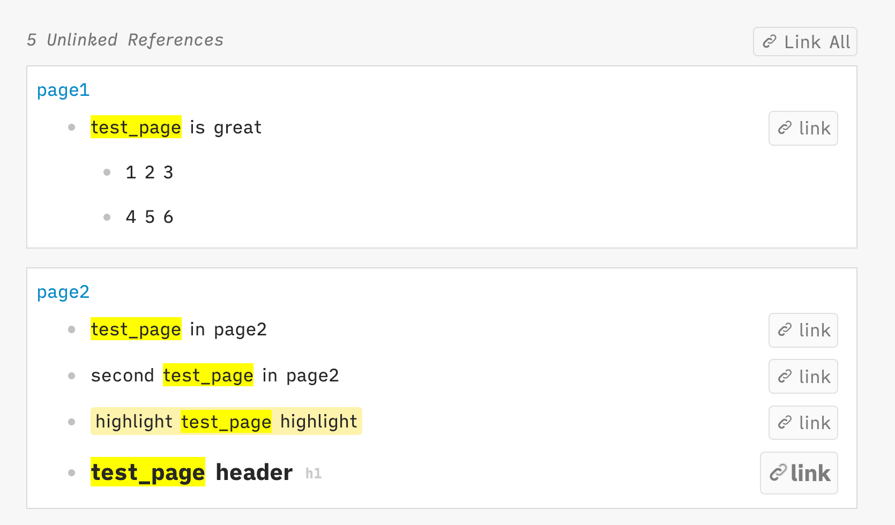

## Link Unlinked References

A plugin for logseq to highlight the keyword in unlinked reference, and provide a button to automatically link them. 

For the 'link-all' button, you may need to click it several times to complete the "real" link-all action, as it only simulates this by clicking all visible link buttons.

You can also highlight the refs and tags in linked references (**need to enable manually in the settings**).

#### Screenshot

Enable highlight in linked references.

#### Demo

#### Marketplace

